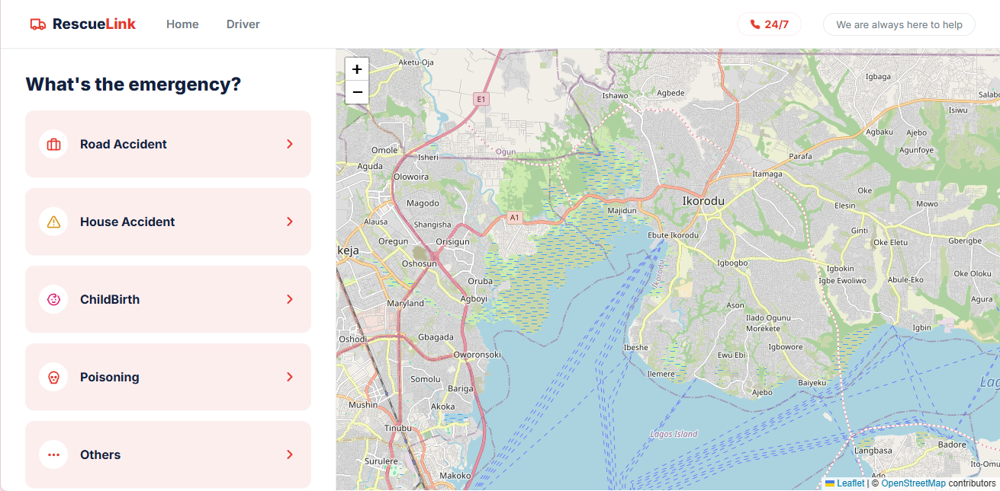

# RescueLink

## Table of Contents

- [Overview](#overview)
  - [Built With](#built-with)
- [Features](#features)
- [How To Use](#how-to-use)
- [Acknowledgements](#acknowledgements)
- [Contact](#contact)

## Overview


RescueLink is a web app that lets a bystander request the nearest available ambulance in one tap during a road accident, childbirth complication, house accident, or other emergency, and track it in real time until it arrives. On the other side, a driver console shows nearby requests ranked by distance, so a driver can accept a case and update its status — Matched, En route, Arrived, Transporting — as the trip actually happens.

- **Where can I see your demo?** https://rescue-link-kappa.vercel.app/
- **What was your experience?** The hardest part wasn't the visual design — it was designing for someone who's panicked, possibly injured. Every screen had to work with almost no typing, and the fallback state (what happens when no ambulance is available) turned out to matter as much as the happy path.
- **What have you learned/improved?** Built the caller and driver flows as a real working app rather than a static mockup — including live maps and actual routing, not placeholder graphics — which meant thinking through real data (locations, distances, trip status) rather than just static screens.
- **Your wisdom? :)** Design the failure states before the success states. What the app does when nothing is available, when the location is wrong, or when a request looks fake is what actually earns trust in an emergency product — the happy path is the easy part.

### Built With

- [HTML](https://developer.mozilla.org/en-US/docs/Web/HTML)
- [CSS](https://developer.mozilla.org/en-US/docs/Web/CSS)
- [JavaScript](https://developer.mozilla.org/en-US/docs/Web/JavaScript) (vanilla — no framework, no build step)
- [Leaflet.js](https://leafletjs.com/) for the interactive map
- [OpenStreetMap](https://www.openstreetmap.org/) for map tiles
- [OSRM](http://project-osrm.org/) for real driving-route directions

## Features

**Top Nav** — Present on every screen

- Brand mark and site name on the left
- "Home" and a second link that switches between the Caller app and the Driver console — this is how you move between the two sides of the product, not a demo toggle
- A visible 24/7 contact pill, since that reassurance matters in an emergency product

**Caller App**

- *Emergency type selection* — one tap on Road Accident, House Accident, ChildBirth, Poisoning, or Others, no typing required
- *Location confirmation* — auto-detected address with a clear confirm step before the request goes out
- *Searching state* — a visible "finding the nearest ambulance" screen while a match is found
- *No-ambulance fallback* — when nothing is available, shows the nearest hospitals directly instead of a dead end
- *Live tracking* — a real map with an actual driving route, a stepper (Matched → En route → Arrived → Transporting), and the driver's name, vehicle, and plate number
- *Trip complete* — a clear confirmation once the trip ends, with an option to start a new request

**Driver Console**

- *Nearby requests* — open cases ranked by distance, each with a verified badge, shown as pins on a live map
- *Request detail* — full case info, requester name and phone, and a route preview before accepting
- *Active trip management* — Start Trip → Mark Arrived → Mark Transporting → Mark Completed, each step updating a real map and a cumulative progress stepper
- *Trip summary* — duration, distance, and a journey timeline once a trip is delivered

**Map** — Real, not illustrative

- Live OpenStreetMap tiles and genuine OSRM-computed driving routes between real coordinates
- The ambulance marker moves along the actual route geometry as the trip progresses, not just between fixed points
- The map persists as one instance across screens — navigating flies/pans the camera smoothly instead of reloading the map each time

## How To Use

To clone and run this application, you'll need [Git](https://git-scm.com) and a text editor — [VS Code](https://code.visualstudio.com/) is a good choice if you don't already have one.

```bash
# Clone this repository
$ git clone https://github.com/your-username/rescuelink

# Change directory into the project
$ cd rescuelink

# Open with VS Code from your terminal
$ code .
```

This is plain HTML/CSS/JS with no build step, but the map needs to be served over `http(s)`, not opened directly as a `file://` path. Serve it locally with either:

```bash
npx serve .
# or
python3 -m http.server 8080
```

Then open the printed `localhost` address in your browser.

No API key or billing account is required — the map runs on Leaflet with free OpenStreetMap tiles and OSRM's free public routing server.

## Acknowledgements

- eHA Academy — UI/UX Design & Frontend Development Cohort
- [Awesome README](https://github.com/matiassingers/awesome-readme)
- [How to write a good README](https://bulldogjob.com/news/449-how-to-write-a-good-readme-for-your-github-project)
- [Leaflet.js](https://leafletjs.com/), [OpenStreetMap](https://www.openstreetmap.org/) contributors, and [OSRM](http://project-osrm.org/) for making a real map possible without a billing account

## Contact

- Website: [website.com](https://your-website.com)
- GitHub: [@username](https://github.com/habeebst)
- Twitter: [@twitter](https://twitter.com/your-username)
